# SVG编辑器功能介绍

## 基本概述

SVG编辑器是一款基于Qt开发的向量图形编辑软件，支持SVG格式文件的创建、编辑和保存。通过直观的界面和丰富的工具集，用户可以轻松创建各种矢量图形并进行编辑。

## 绘图功能

- **基础形状**：矩形、椭圆、线条、圆形

- **高级形状**：多边形、星形、五边形、六边形。自定义多边形需要右键结束绘制，也可以点击菜单栏结束绘制，如果少于3个点则取消，大于等于三个点则立即完成绘制。

- **文本**：支持添加和编辑文本内容，文本可以通过改变字体样式或者字体大小来改变图形大小。双击编辑文本。

  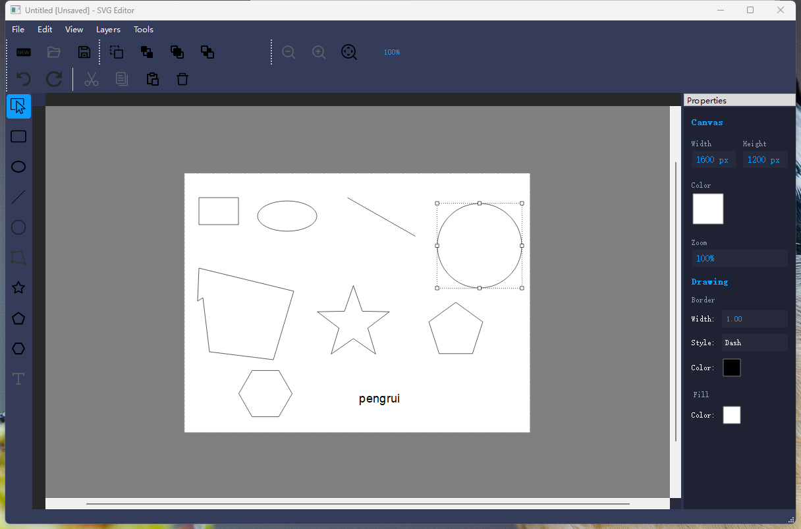

## 编辑功能

- **选择工具**：点选或框选图形元素，支持快捷键全选

- **移动**：拖拽移动图形位置，支持多选拖拽。

  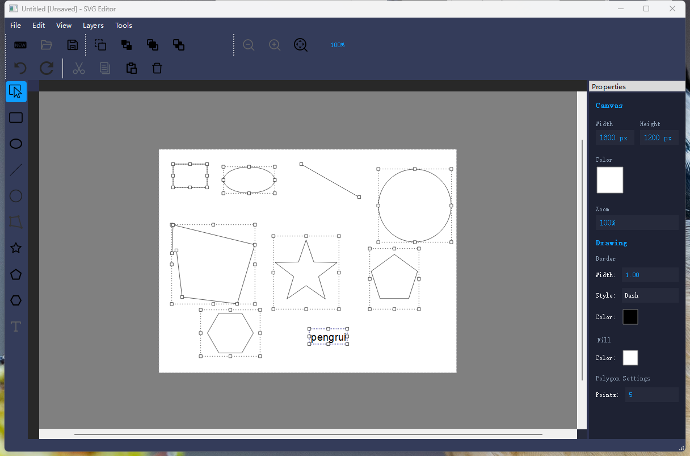

- **调整大小**：通过控制点调整图形尺寸，选择工具靠近控制点会显示光标，拖动计算偏移量改变大小。

  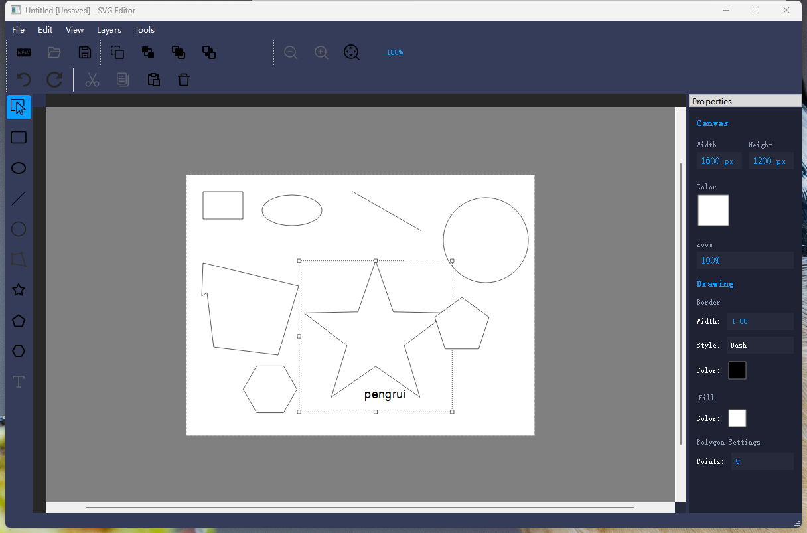

- **复制/粘贴**：支持图形的复制和粘贴操作。

  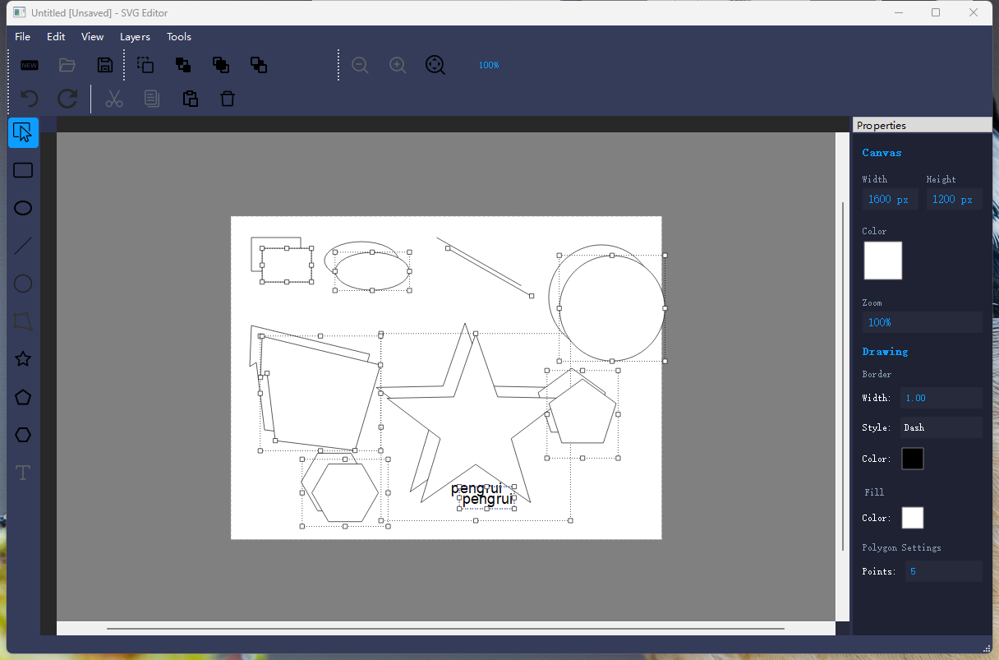

- **删除**：删除选中图形，支持退格键和delete键删除

  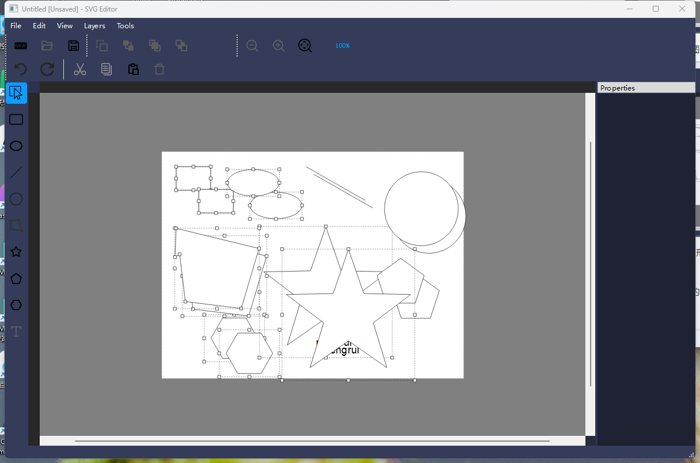

  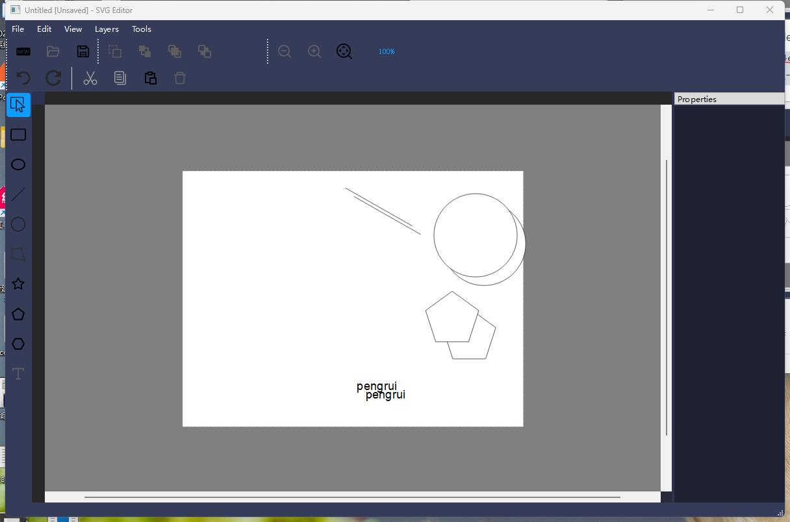

- **撤销/重做**：完整的撤销和重做功能，支持单个图形和多选删除

## 图层操作

- **层级调整**：

  - 置于顶层

  - 置于底层

  - 上移一层

  - 下移一层

    通过移动图形的z轴位置调整层级

## 样式设置

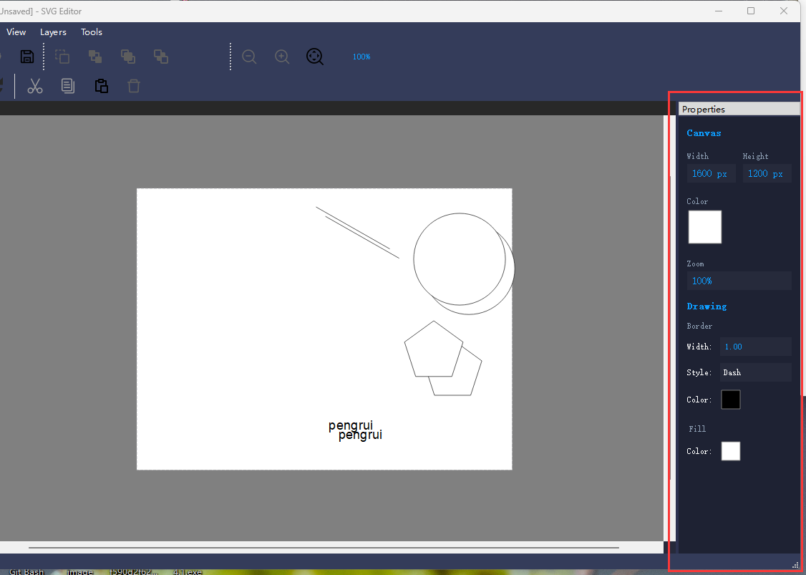

右边是属性栏，上面是画布的属性，下面是选中图形的属性，可以通过滚轮调整画布或图形属性。

- **边框属性**：

  - 边框宽度调整
  - 边框颜色设置
  - 边框样式选择（实线、虚线等）

- **填充属性**：

  - 填充颜色设置
  - 透明度调整

- **文本属性**：

  - 字体选择

  - 字号调整

  - 文本颜色设置

    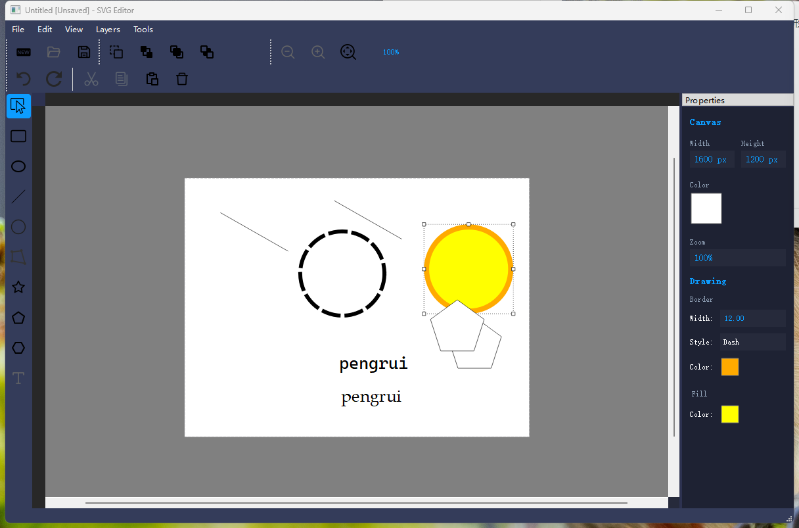

## 文件管理

- **新建**：创建新的SVG文档

- **打开**：打开已有的SVG文件

- **保存**：保存当前编辑的文件

- **另存为**：将当前文件另存为新文件

- **导出**：将SVG导出为PNG、JPG等图像格式

  导出为svg格式：

  

  导出为png格式：

  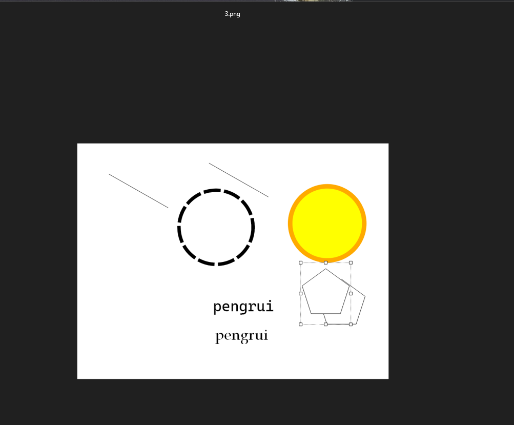

## 视图控制

- **缩放功能**：

  - 放大
  - 缩小
  - 重置缩放
  - 精确缩放百分比调整

- **画布控制**：

  - 画布大小调整

  - 画布背景颜色设置

  - 显示/隐藏画布边框

    游标和画布同步放大缩小

    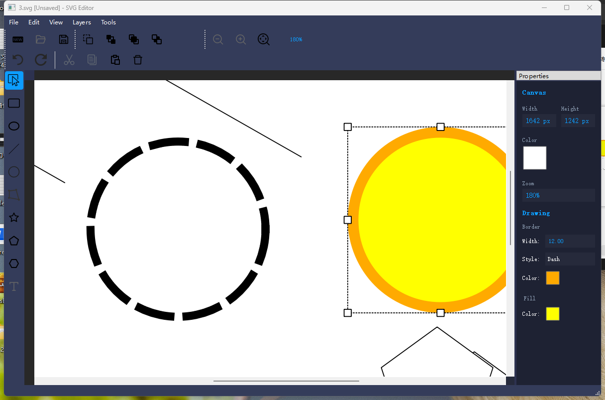

    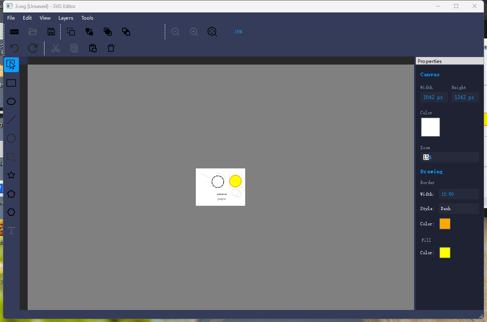

## 辅助工具

- **标尺**：水平和垂直标尺辅助定位
- **状态栏**：显示当前操作状态和提示信息
- **右键菜单**：快速访问常用功能

## 用户界面

- **主题界面**：深色主题
- **属性面板**：实时显示和编辑选中对象的属性
- **工具栏**：直观的工具按钮布局

## 性能优化

- **边界管理**：防止对象被拖动到视图外无法恢复的位置
- **缩放优化**：保持视图中心点不变的缩放机制
- **扩展边界区域**：在可视画布周围提供额外操作空间

该SVG编辑器适合用于创建和编辑简单到中等复杂度的SVG图形，可用于图标设计、简单插图制作和矢量图形编辑等场景。
